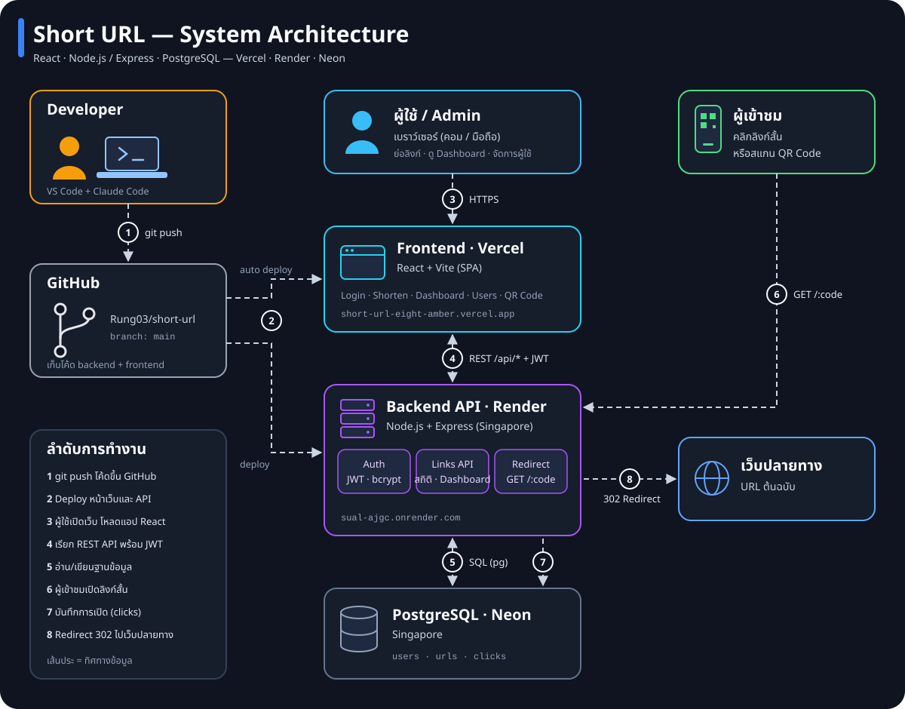
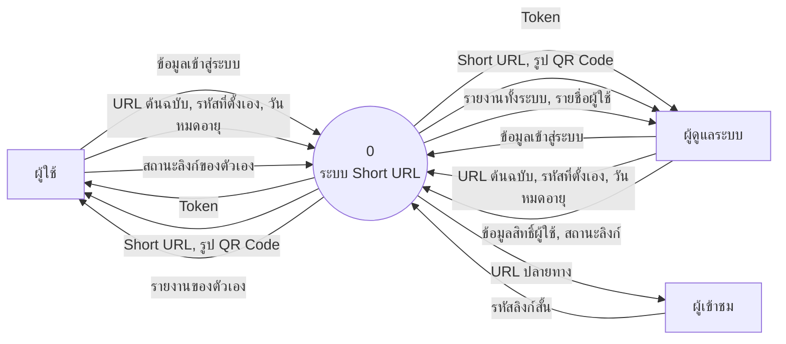
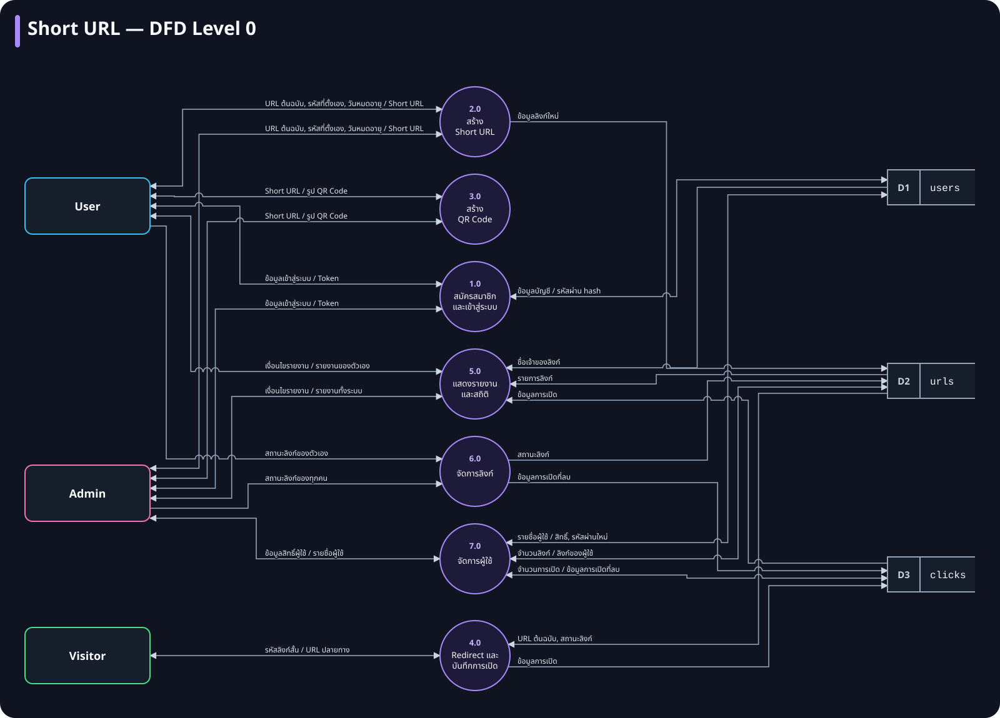
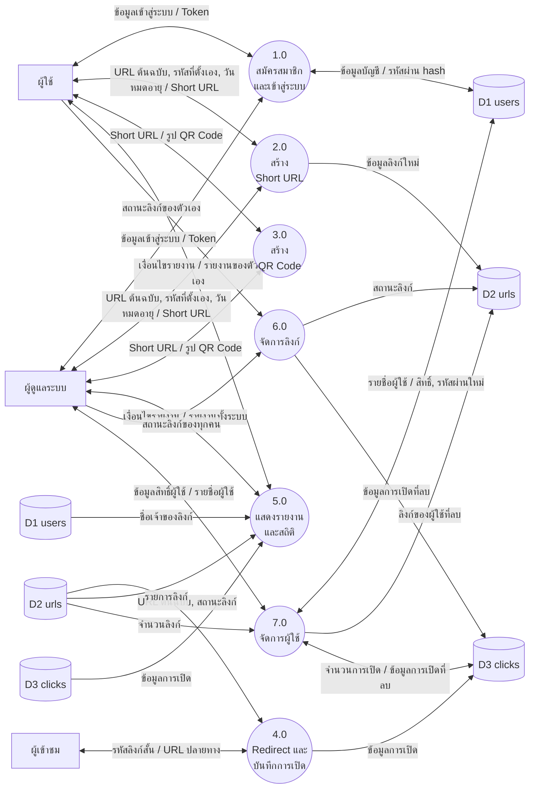
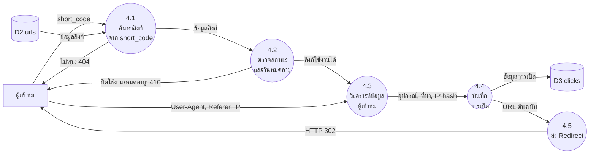
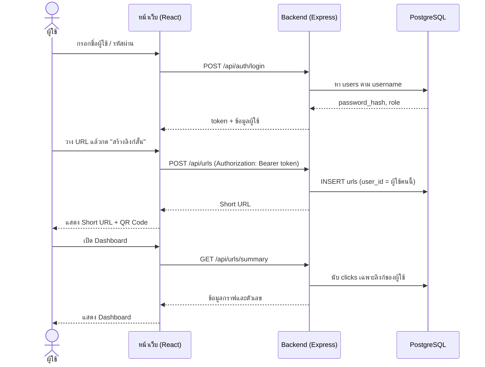
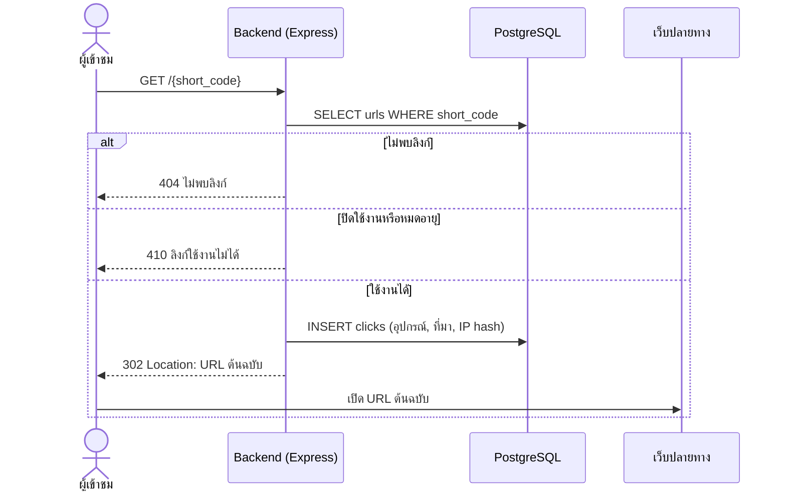
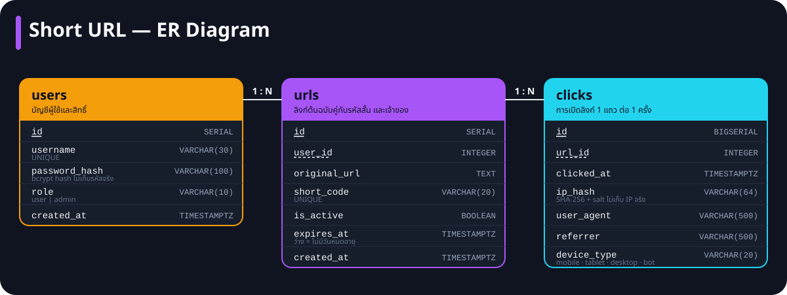
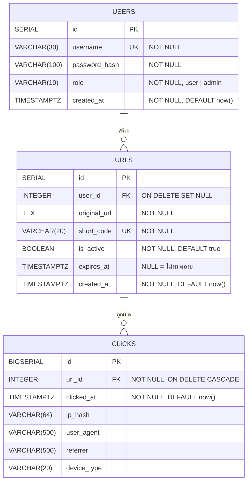

# เอกสารออกแบบระบบ Short URL

เอกสารนี้อธิบายการไหลของข้อมูล (DFD) และโครงสร้างฐานข้อมูล (ER) ของระบบย่อลิงก์
ภาพทั้งหมดเขียนด้วย [Mermaid](https://mermaid.js.org) GitHub แสดงเป็นแผนภาพให้อัตโนมัติ

ภาพรวม Architecture + DFD + ER ในภาพเดียว: [system-overview.svg](system-overview.svg)

## สารบัญ

1. [ผู้เกี่ยวข้องกับระบบ](#1-ผู้เกี่ยวข้องกับระบบ)
2. [Context Diagram](#2-context-diagram)
3. [DFD Level 0](#3-dfd-level-0)
4. [ข้อมูลเข้า-ออกของแต่ละกระบวนการ](#4-ข้อมูลเข้า-ออกของแต่ละกระบวนการ)
5. [DFD Level 1: กระบวนการ 4.0 Redirect และบันทึกการเปิด](#5-dfd-level-1-กระบวนการ-40-redirect-และบันทึกการเปิด)
6. [Workflow](#6-workflow)
7. [ER Diagram](#7-er-diagram)
8. [Data Dictionary](#8-data-dictionary)
9. [Normalization](#9-normalization)

---

## 1. ผู้เกี่ยวข้องกับระบบ

| ผู้เกี่ยวข้อง | ต้องเข้าสู่ระบบ | สิ่งที่ทำได้ |
|---|---|---|
| **ผู้ใช้ (User)** | ใช่ | สมัครสมาชิก, สร้างลิงก์สั้นและ QR Code, ดูรายงานและสถิติ, เปิด/ปิด/ลบ **เฉพาะลิงก์ของตัวเอง** |
| **ผู้ดูแลระบบ (Admin)** | ใช่ | ทำได้ทุกอย่างของผู้ใช้ + ดูรายงาน **ทั้งระบบหรือแยกรายผู้ใช้**, จัดการลิงก์ทุกอัน, จัดการผู้ใช้ (ตั้ง/ถอด admin, รีเซ็ตรหัสผ่าน, ลบผู้ใช้) |
| **ผู้เข้าชม (Visitor)** | ไม่ | คลิกลิงก์สั้นหรือสแกน QR Code แล้วถูกพาไปยัง URL ต้นฉบับ |

---

## 2. Context Diagram

ภาพรวมระดับสูงสุด: ระบบทั้งหมดเป็นกระบวนการเดียว แสดงเฉพาะข้อมูลที่ไหลเข้า-ออกระหว่างระบบกับผู้เกี่ยวข้องภายนอก

---

## 3. DFD Level 0

แตกระบบออกเป็น 7 กระบวนการหลัก และคลังข้อมูล 3 แห่ง (ตรงกับตารางในฐานข้อมูล)

แบบ Mermaid (ข้อมูลเดียวกัน คลัง D2, D3 วาดซ้ำฝั่งซ้ายสำหรับการอ่าน เพื่อลดเส้นตัดกัน):

### คลังข้อมูล

| รหัส | ชื่อ | เก็บอะไร |
|---|---|---|
| D1 | `users` | บัญชีผู้ใช้ รหัสผ่านแบบ hash และสิทธิ์ |
| D2 | `urls` | ลิงก์ต้นฉบับ รหัสสั้น สถานะ วันหมดอายุ และเจ้าของ |
| D3 | `clicks` | การเปิดลิงก์แต่ละครั้ง (เวลา, อุปกรณ์, ที่มา, IP แบบ hash) |

---

## 4. ข้อมูลเข้า-ออกของแต่ละกระบวนการ

| กระบวนการ | ข้อมูลเข้า | ประมวลผล | ข้อมูลออก | คลังข้อมูล |
|---|---|---|---|---|
| **1.0 สมัครสมาชิกและเข้าสู่ระบบ** | ชื่อผู้ใช้, รหัสผ่าน | ตรวจรูปแบบ, hash รหัสผ่านด้วย bcrypt (สมัคร) หรือเทียบ hash (เข้าสู่ระบบ), จำกัดการเข้าสู่ระบบผิด 5 ครั้ง / 15 นาที | Token (JWT อายุ 7 วัน), ข้อมูลผู้ใช้และสิทธิ์ | เขียน/อ่าน D1 |
| **2.0 สร้าง Short URL** (ผู้ใช้และผู้ดูแลระบบ) | Token, URL ต้นฉบับ, รหัสที่ตั้งเอง (ถ้ามี), วันหมดอายุ (ถ้ามี) | ตรวจ URL (เติม `https://`, รับเฉพาะ http/https, ห้ามย่อโดเมนตัวเอง), สุ่มรหัส 7 ตัว หรือใช้รหัสที่ตั้งเอง | Short URL | เขียน D2 |
| **3.0 สร้าง QR Code** (ผู้ใช้และผู้ดูแลระบบ) | Short URL | สร้างภาพ QR ฝั่งเบราว์เซอร์ | รูป QR Code (ดาวน์โหลดเป็น PNG ได้) | — |
| **4.0 Redirect และบันทึกการเปิด** | short_code, User-Agent, Referer, IP | หาลิงก์, ตรวจว่าเปิดใช้งานและยังไม่หมดอายุ, แยกอุปกรณ์จาก User-Agent, hash IP | HTTP 302 ไปยัง URL ต้นฉบับ (หรือ 404 / 410) | อ่าน D2, เขียน D3 |
| **5.0 แสดงรายงานและสถิติ** | Token, คำค้นหา, ผู้ใช้ที่เลือก (admin) | กรองลิงก์ตามเจ้าของ (admin เห็นทั้งหมด), นับการเปิด, ผู้เข้าชมไม่ซ้ำ, กราฟ 14 วัน, แยกอุปกรณ์และที่มา | Dashboard, ตารางลิงก์ (admin เห็นชื่อเจ้าของ), สถิติรายลิงก์ | อ่าน D1, D2, D3 |
| **6.0 จัดการลิงก์** | Token, id ลิงก์, คำสั่งเปิด/ปิด/ลบ | ตรวจว่าเป็นเจ้าของหรือ admin (ไม่ใช่ตอบ 404) | ลิงก์ที่อัปเดต | เขียน D2, ลบใน D3 |
| **7.0 จัดการผู้ใช้** | Token (admin), id ผู้ใช้, สิทธิ์ใหม่ / รหัสผ่านใหม่ / คำสั่งลบ | ห้ามแก้ admin หลักและบัญชีตัวเอง | รายชื่อผู้ใช้พร้อมจำนวนลิงก์และการเปิด | อ่าน/เขียน D1, ลบใน D2, D3 |

---

## 5. DFD Level 1: กระบวนการ 4.0 Redirect และบันทึกการเปิด

กระบวนการที่ทำงานบ่อยที่สุดในระบบ (ทุกครั้งที่มีคนคลิกลิงก์สั้นหรือสแกน QR)

- ใช้ **302** ไม่ใช่ 301 และส่ง `Cache-Control: no-store` เพื่อให้เบราว์เซอร์กลับมาถามเซิร์ฟเวอร์ทุกครั้ง จึงนับการเปิดได้ครบ และปิดลิงก์แล้วมีผลทันที
- ถ้าบันทึกการเปิด (4.4) ล้มเหลว ระบบยังส่ง Redirect (4.5) ต่อ เพื่อไม่ให้ผู้เข้าชมไปไม่ถึงปลายทาง

---

## 6. Workflow

### 6.1 ผู้ใช้สร้างลิงก์และดูสถิติ

### 6.2 ผู้เข้าชมเปิดลิงก์สั้น

---

## 7. ER Diagram

แบบ Mermaid (ข้อมูลเดียวกัน):

### ความสัมพันธ์

| ความสัมพันธ์ | ชนิด | ความหมาย | เมื่อลบฝั่ง "หนึ่ง" |
|---|---|---|---|
| `users` → `urls` | 1 : N | ผู้ใช้ 1 คนสร้างลิงก์ได้หลายอัน ลิงก์ 1 อันมีเจ้าของได้ 1 คน | `user_id` เป็น NULL (ระบบลบลิงก์ของผู้ใช้ก่อนลบบัญชีอยู่แล้ว) |
| `urls` → `clicks` | 1 : N | ลิงก์ 1 อันถูกเปิดได้หลายครั้ง การเปิด 1 ครั้งเป็นของลิงก์เดียว | ลบข้อมูลการเปิดทั้งหมดของลิงก์นั้น (CASCADE) |

---

## 8. Data Dictionary

### ตาราง `users`

| คอลัมน์ | ชนิดข้อมูล | Key | ว่างได้ | ค่าเริ่มต้น | คำอธิบาย |
|---|---|---|---|---|---|
| `id` | SERIAL | PK | ไม่ | ลำดับอัตโนมัติ | รหัสผู้ใช้ |
| `username` | VARCHAR(30) | UK | ไม่ | — | ชื่อผู้ใช้ ตัวพิมพ์เล็ก a-z, 0-9, `_` `.` `-` ยาว 3-30 ตัว |
| `password_hash` | VARCHAR(100) | | ไม่ | — | รหัสผ่านที่ผ่าน bcrypt แล้ว ไม่เก็บรหัสผ่านจริง |
| `role` | VARCHAR(10) | | ไม่ | `user` | สิทธิ์ `user` หรือ `admin` (CHECK) |
| `created_at` | TIMESTAMPTZ | | ไม่ | `now()` | วันเวลาที่สมัคร |

### ตาราง `urls`

| คอลัมน์ | ชนิดข้อมูล | Key | ว่างได้ | ค่าเริ่มต้น | คำอธิบาย |
|---|---|---|---|---|---|
| `id` | SERIAL | PK | ไม่ | ลำดับอัตโนมัติ | รหัสลิงก์ |
| `user_id` | INTEGER | FK → `users.id` | ได้ | — | เจ้าของลิงก์ |
| `original_url` | TEXT | | ไม่ | — | URL ต้นฉบับ (http/https ยาวไม่เกิน 2,048 ตัว) |
| `short_code` | VARCHAR(20) | UK | ไม่ | — | รหัสสั้น สุ่ม 7 ตัวจาก base62 หรือตั้งเอง 3-20 ตัว |
| `is_active` | BOOLEAN | | ไม่ | `true` | เปิด/ปิดการใช้งานลิงก์ |
| `expires_at` | TIMESTAMPTZ | | ได้ | — | วันหมดอายุ ถ้าว่างแปลว่าไม่มีวันหมดอายุ |
| `created_at` | TIMESTAMPTZ | | ไม่ | `now()` | วันเวลาที่สร้าง |

### ตาราง `clicks`

| คอลัมน์ | ชนิดข้อมูล | Key | ว่างได้ | ค่าเริ่มต้น | คำอธิบาย |
|---|---|---|---|---|---|
| `id` | BIGSERIAL | PK | ไม่ | ลำดับอัตโนมัติ | รหัสการเปิด |
| `url_id` | INTEGER | FK → `urls.id` | ไม่ | — | ลิงก์ที่ถูกเปิด |
| `clicked_at` | TIMESTAMPTZ | | ไม่ | `now()` | วันเวลาที่เปิด |
| `ip_hash` | VARCHAR(64) | | ได้ | — | SHA-256 ของ IP ผสม salt ใช้นับผู้เข้าชมไม่ซ้ำโดยไม่เก็บ IP จริง |
| `user_agent` | VARCHAR(500) | | ได้ | — | ข้อมูลเบราว์เซอร์และระบบปฏิบัติการ |
| `referrer` | VARCHAR(500) | | ได้ | — | เว็บที่กดลิงก์มา ว่างเมื่อเข้าตรงหรือสแกน QR |
| `device_type` | VARCHAR(20) | | ได้ | — | `mobile`, `tablet`, `desktop`, `bot` หรือ `unknown` |

ดัชนีเพิ่มเติม: `idx_urls_user (user_id)` สำหรับกรองลิงก์ตามเจ้าของ และ `idx_clicks_url_time (url_id, clicked_at)` สำหรับนับสถิติรายวัน

---

## 9. Normalization

| ระดับ | เงื่อนไข | ระบบนี้ |
|---|---|---|
| **1NF** | ทุกคอลัมน์เก็บค่าเดียว ไม่มีกลุ่มข้อมูลซ้ำ | การเปิดแต่ละครั้งเป็นแถวของตัวเองใน `clicks` ไม่เก็บเป็นรายการในแถวของ `urls` |
| **2NF** | ผ่าน 1NF และทุกคอลัมน์ขึ้นกับ Primary Key ทั้งหมด | ทุกตารางใช้ Primary Key คอลัมน์เดียว (`id`) จึงไม่มีการขึ้นกับคีย์บางส่วน |
| **3NF** | ผ่าน 2NF และไม่มีคอลัมน์ที่ขึ้นกับคอลัมน์อื่นที่ไม่ใช่คีย์ | ข้อมูลผู้ใช้อยู่ใน `users` ที่เดียว `urls` เก็บแค่ `user_id` และ `clicks` เก็บแค่ `url_id` |

ข้อมูลที่คำนวณได้ไม่เก็บซ้ำ:

| ข้อมูล | ได้มาจาก |
|---|---|
| จำนวนการเปิดของลิงก์ | `COUNT(*)` จาก `clicks` |
| ผู้เข้าชมไม่ซ้ำ | `COUNT(DISTINCT ip_hash)` จาก `clicks` |
| Short URL เต็ม | `BASE_URL` + `short_code` |
| รูป QR Code | สร้างจาก Short URL ทุกครั้งที่แสดง |
| สถานะ "หมดอายุ" | เทียบ `expires_at` กับเวลาปัจจุบัน |
| สถิติแยกตามที่มา | ตัดชื่อโดเมนออกจาก `referrer` ตอนดึงข้อมูล |
